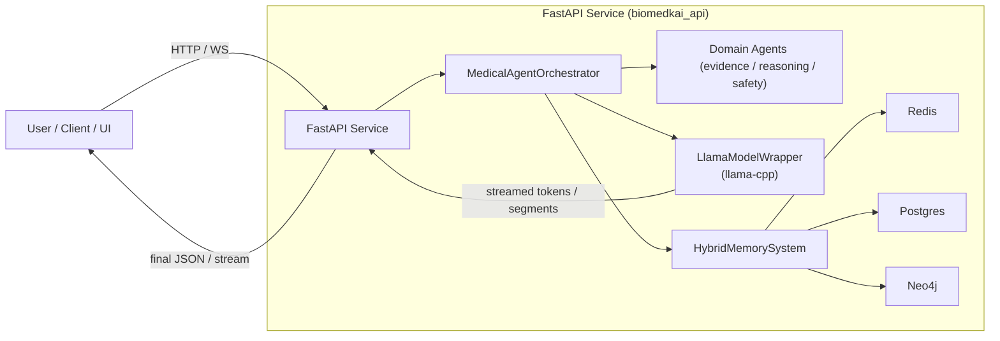

# 🧬 BioMed-KAI

**Agentic Biomedical Reasoning with Graph-Augmented Memory, FastAPI + WebSocket, and Reproducible CLI**

<div align="center">

[](#license)
[](https://fastapi.tiangolo.com/)
[](README-LLAMACCPP.md)
[](https://neo4j.com/)
[](https://www.python.org/)

</div>

---

## 1) Overview

**BioMed-KAI (Biomedical Knowledge-Aided Intelligence)** is a **config-first, modular, agentic RAG** framework for biomedical question answering, literature-aware synthesis, and graph-integrated reasoning.

What you get:

* **Agentic orchestration** — `MedicalAgentOrchestrator` coordinates domain agents (evidence, reasoning, safety).
* **Graph-augmented memory** — hybrid short/long/graph memory via Redis, Postgres, and **Neo4j**.
* **Unified service** — FastAPI HTTP + **WebSocket streaming** with incremental output.
* **Local LLM** — `LlamaModelWrapper` using **llama-cpp-python** (CPU or GPU) for on-prem inference.
* **Reproducible CLI** — run the same pipelines headless for experiments & paper artifacts.
* **Structured logging** — `structlog` JSON logs for auditability and tracing.

---

## 2) Repository Layout (current)

```
BioMed-KAI/
├─ biomedkai/                   # Core Python package (shared utils, tools, adapters)
│
├─ biomedkai_api/               # Web service (FastAPI + WS)
│  ├─ api/                      #   REST + WebSocket routers
│  ├─ config/                   #   pydantic / OmegaConf settings
│  ├─ core/                     #   MedicalAgentOrchestrator (agent/routing glue)
│  ├─ memory/                   #   HybridMemorySystem (Redis, Postgres, Neo4j)
│  ├─ models/                   #   LlamaModelWrapper (llama.cpp runtime)
│  ├─ monitoring/               #   metrics & health endpoints
│  ├─ safety/, tools/           #   validation & tool registry
│  └─ main.py                   #   FastAPI app (lifespan boot)
│
├─ apps/                        # UI/visualization (if present)
├─ services/                    # auxiliary/legacy services (kept for compat)
├─ experiments/                 # multilingual pilot / eval harnesses
├─ docker/                      # Dockerfiles & compose (optional)
│
├─ .env.example                 # example environment variables
├─ pyproject.toml               # entry points: biomedkai, biomedkai-api
├─ README-LLAMACCPP.md          # llama.cpp build/install guidance
└─ README.md                    # this document
```

---

## 3) Features

| Area                       | What’s included                                                                                                                                        |
| -------------------------- | ------------------------------------------------------------------------------------------------------------------------------------------------------ |
| **Agents & Orchestration** | Multi-agent coordination (`MedicalAgentOrchestrator`) with rule/learned routing (internals), evidence synthesis, reasoning, and optional safety gating |
| **LLM Runtime**            | `LlamaModelWrapper` (llama-cpp-python); CPU baseline, **GPU offload** via CUDA/Metal/ROCm                                                              |
| **Memory**                 | `HybridMemorySystem` binds Redis (short-term), Postgres (long-term), **Neo4j** graph                                                                   |
| **Web Service**            | FastAPI REST + **WebSocket** streaming; CORS enabled for local dev                                                                                     |
| **CLI**                    | Reproducible command-line interface, mirroring API behavior                                                                                            |
| **Observability**          | `structlog` JSON logs; health check and metrics endpoints                                                                                              |

---

## 4) Installation

### 4.1 Prerequisites

* **Python 3.10+**
* Optional services (recommended in production): **Redis**, **PostgreSQL**, **Neo4j**
* For GPU inference: suitable **NVIDIA driver** and CUDA runtime (e.g., 12.4) or **Metal** (macOS)

### 4.2 Install the package

```bash
git clone https://github.com/chemplusx/BioMed-KAI.git
cd BioMed-KAI
pip install -e .
```

If your environment is missing logging/runtime deps:

```bash
pip install structlog fastapi uvicorn redis neo4j psycopg2-binary omegaconf pydantic
```

### 4.3 Install the LLM backend (llama.cpp)

See **README-LLAMACCPP.md** for full, platform-specific instructions.

**CPU (quick start):**

```bash
pip install "llama-cpp-python==0.2.90"
```

**GPU (example: CUDA 12.4, Windows/Linux):**

```bash
pip install --no-cache-dir \
  --extra-index-url https://abetlen.github.io/llama-cpp-python/whl/cu124 \
  "llama-cpp-python==0.2.90"
```

> **Tip:** set `n_gpu_layers > 0` in your config to enable GPU offload. If a CPU wheel is detected while offload is requested, the app raises a clear, actionable error.

---

## 5) Quick Start

### 5.1 Start the API

Using the entry point:

```bash
biomedkai-api
```

Or explicitly:

```bash
python -m uvicorn biomedkai_api.main:app --reload --log-level debug
```

* Docs: [http://localhost:8000/docs](http://localhost:8000/docs)
* Health: `GET /health`

**Fast boot while wiring services (optional):**

```bash
# bring up the server before model/memory are ready
set BIOMEDKAI_SKIP_MODEL=1
set BIOMEDKAI_SKIP_MEMORY=1
biomedkai-api
```

Unset those envs later for full operation.

### 5.2 CLI (reproducible runs)

```bash
biomedkai "Summarize evidence for paracetamol in knee osteoarthritis."
```

Examples:

```bash
# choose an agent explicitly (for ablations)
biomedkai --agent evidence_agent --out out.json "Explain CYP2D6 polymorphism impact on tamoxifen"

# use a config file (OmegaConf YAML)
biomedkai --config biomedkai_api/config/agent.yaml "Mechanism of SGLT2 inhibitors in HF"
```

---

## 6) API Surface

### 6.1 REST

Key endpoints (stable, minimal, and UI-friendly):

| Method | Path                  | Description                                                                         |
| -----: | --------------------- | ----------------------------------------------------------------------------------- |
| `POST` | `/api/v1/chat`        | Non-streaming QA; returns final JSON answer                                         |
| `POST` | `/api/v1/chat/stream` | **NDJSON stream**: `session_start` → multiple `response_chunk` → `session_complete` |
|  `GET` | `/health`             | Liveness/readiness                                                                  |

**Stream framing (NDJSON):**

```json
{"type": "session_start", "session_id": "..."}
{"type": "response_chunk", "text": "partial text..."}
{"type": "response_chunk", "text": "next part..."}
{"type": "session_complete", "usage": {...}, "agent": "evidence_agent"}
```

> A one-off `"routing_info"` NDJSON line may be included for audit (agent choice & scores). The UI can ignore it safely.

### 6.2 WebSocket (incremental generation)

**Endpoint:** `ws://localhost:8000/ws/chat`
(alternative path with session id is supported if present in your router)

**Server → client frames (kept exactly as in your code):**

```json
{ "type": "GENERATE_RESPONSE", "stream_start": true }
{ "type": "GENERATE_RESPONSE", "chunk": "tokenized or segmented text...", "agent_mode": true }
{ "type": "GENERATE_RESPONSE", "stream_end": true }
```

**Python client example:**

```python
import asyncio, websockets, json

async def chat():
    async with websockets.connect("ws://localhost:8000/ws/chat") as ws:
        await ws.send(json.dumps({
            "type": "query",
            "prompt": "Explain CRISPR-Cas9 mechanism",
            "use_agents": True
        }))
        async for raw in ws:
            msg = json.loads(raw)
            if msg.get("stream_start"):
                print("\n--- stream start ---\n")
            if "chunk" in msg:
                print(msg["chunk"], end="", flush=True)
            if msg.get("stream_end"):
                print("\n--- stream end ---\n")
                break

asyncio.run(chat())
```

---

## 7) Configuration

Configuration is handled via **OmegaConf (YAML)** + **Pydantic** settings. Typical fields:

```yaml
runtime:
  device: "cuda"          # "cpu" or "cuda"
  seed: 42

llm:
  provider: "llama_cpp"
  model_path: "H:/models/gguf/YourModel.gguf"
  n_ctx: 8192
  n_threads: 8
  n_gpu_layers: 32        # >0 enables GPU offload
  temperature: 0.2
  top_p: 0.9
  repeat_penalty: 1.1
  chat_format: "llama-3"

memory:
  redis_host: "localhost"
  redis_port: 6379
  postgres_user: "medical_ai"
  postgres_password: "password"
  postgres_host: "localhost"
  postgres_port: 5432
  postgres_db: "medical_memory"
  neo4j_uri: "neo4j://localhost:7687"
  neo4j_user: "neo4j"
  neo4j_password: "password"
```

**Useful environment variables**

```
APP_PORT=8000
APP_RELOAD=1
APP_LOG_LEVEL=debug
BIOMEDKAI_SKIP_MODEL=0
BIOMEDKAI_SKIP_MEMORY=0
```

**Performance tuning (llama.cpp)**

* Increase `n_gpu_layers` until VRAM is close to the safe limit.
* Adjust `n_threads` to the number of performance CPU cores.
* Consider `n_ctx` vs latency trade-offs (bigger context costs more memory/time).

---

## 8) System Architecture



### Execution flow (end-to-end)

1. **Client** sends prompt via REST (`/api/v1/chat` or `/api/v1/chat/stream`) or **WebSocket** (`/ws/chat`).
2. **FastAPI** forwards to `MedicalAgentOrchestrator`.
3. **Orchestrator** selects/coordinates agents and calls:

   * **`LlamaModelWrapper`** (local inference via llama.cpp, streamed or chunked)
   * **`HybridMemorySystem`** (retrieve context from Redis/PG/Neo4j)
   * **Tools/Safety** as configured
4. **Streaming path** yields incremental chunks (`GENERATE_RESPONSE` frames) to the client.
5. **Finalization** returns a structured record (agent, usage, evidence summary if applicable).

---

## 9) Reproducibility & Research

* Use the **CLI** for headless runs (saves JSON artifacts).
* Log structure includes:

  * agent selection (if enabled)
  * evidence identifiers / retrieval metadata
  * model parameters & seeds
  * outputs + optional scores (BERTScore/ROUGE if added in `experiments/`)

Example:

```bash
biomedkai --out results/oa_paracetamol.json \
  "Summarize RCT evidence for paracetamol in osteoarthritis."
```

### Multilingual pilot (experiments/)

The `experiments/` folder contains harnesses for multilingual evaluation (prompts, per-language outputs).
Run via CLI or an eval route if you expose one; artifacts are written under `results/`.

---

## 10) Development Guide

### Local dev setup

```bash
pip install -e .[dev]        # if you maintain a dev extra
pre-commit install           # if repo has hooks
```

### Tests

```bash
pytest -q
```

### Docker (optional)

```bash
docker build -t biomedkai .
docker run -p 8000:8000 --env-file .env biomedkai
```

### Logging & diagnostics

* **structlog** emits JSON logs (easy to ship to ELK/Datadog).
* To see early import/startup failures on Windows, run:

  ```bash
  python -X dev -m uvicorn biomedkai_api.main:app --log-level debug
  ```
* Startup toggles:

  * `BIOMEDKAI_SKIP_MODEL=1` — skip LLM load during boot.
  * `BIOMEDKAI_SKIP_MEMORY=1` — skip Redis/PG/Neo4j init during boot.

---

## 11) Troubleshooting

| Symptom                                    | Likely Cause                                                                      | Fix                                                                                                                                                      |
| ------------------------------------------ | --------------------------------------------------------------------------------- | -------------------------------------------------------------------------------------------------------------------------------------------------------- |
| `biomedkai-api` “hangs” with no output     | Import error before Uvicorn (e.g., `structlog` missing) or blocking lifespan init | Run `python -m uvicorn biomedkai_api.main:app --reload --log-level debug` to see the traceback. Install missing deps. Use `BIOMEDKAI_SKIP_*` to isolate. |
| GPU not used (`n_gpu_layers>0` but 0% GPU) | CPU wheel of `llama-cpp-python` installed                                         | Reinstall a **GPU** wheel from the maintainer index (see **README-LLAMACCPP.md**).                                                                       |
| Neo4j/Redis/Postgres connection timeouts   | Services not running, wrong creds                                                 | Start services; verify URLs from `.env` / config; check firewall/ports.                                                                                  |
| WebSocket connects but no chunks           | Orchestrator not yielding; model not initialized                                  | Check logs; confirm LLM path exists; try CPU first, then GPU.                                                                                            |
| NDJSON client parses nothing               | Client expecting JSON array instead of NDJSON                                     | Read line-by-line; each line is a JSON object.                                                                                                           |

---

## 12) Security & Data Handling

* This repository is **research software**. It is **not** a medical device and should **not** be used for clinical decision-making.
* When using real or sensitive data:

  * remove PHI
  * disable external network calls from within agents/tools
  * follow your IRB/data governance policies

---

## 13) Roadmap

* Optional **token-level llama.cpp streaming** (already compatible with WS framing)
* Configurable **agent router** (rule / learned / bandit) surfaced via API/CLI flags
* Extended **multilingual** evaluation harness and metrics
* Pluggable **indexers** for literature & pathway corpora

---

## 14) Contributing

PRs are welcome. Please include:

* a brief design note (what/why)
* tests for new behaviors
* updates to README/configs if applicable

---

## 15) License

**MIT** — see `LICENSE`.

---

## 16) Contact

* **Maintainer:** [@chemplusx](https://github.com/chemplusx)
* For collaboration or demo requests, open an issue or reach out via the profile email.

---
